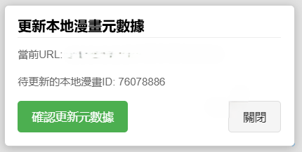

# Lanraragi 元數據助手

## 簡介

Lanraragi 元數據助手是一個瀏覽器擴展，旨在幫助用戶自動更新本地漫畫服務的元數據。它提供了一個便捷的界面，讓您在瀏覽支持的網站時能夠快速地將元數據配對到 Lanraragi 服務中的漫畫中。

## 功能特點

- 自動代理與 Lanraragi 之間的操作，大幅減少操作複雜度
- 提供直觀的用戶界面，顯示更新狀態和進度
- 支持從外部網站一鍵獲取元數據並更新本地漫畫
- 全程顯示每一步操作的狀態和結果，且能記住面板狀態，提供流暢的用戶體驗

## 安裝方法

1. 下載 `src` 資料夾並自行重新命名或移動位置 (導入後不能移動或重命名)
2. 打開 Chrome 瀏覽器，進入擴展程序頁面（chrome://extensions/）
3. 啟用「開發者模式」
4. 點擊「加載已解壓的擴展程序」
5. 選擇剛才下載的 `src` 資料夾

## 使用方法

### 在本地 Lanraragi 服務中

1. 瀏覽您的本地漫畫詳情頁
2. 點擊頁面右下角的「漫畫元數據」按鈕
3. 在彈出的面板中輸入搜索關鍵字
4. 點擊搜索按鈕，在新標籤頁中打開搜索結果，漫畫ID會自動從URL獲取並保存

### 在支持的外部網站

1. 在搜索結果頁面中找到並點擊目標漫畫
2. 進入漫畫詳情頁後，點擊右下角的「漫畫元數據」按鈕
3. 確認顯示的本地漫畫ID是否正確，點擊「確認更新元數據」按鈕
4. 查看更新進度和結果

### 介面預覽

## 隱私說明

此擴展僅在您訪問特定網站時啟用，不會收集任何個人數據。它在本地存儲漫畫ID信息，用於關聯本地漫畫和外部網站的元數據。所有數據處理都在您的設備上進行。

## 許可權限說明

- storage: 用於保存漫畫ID和面板顯示狀態
- activeTab & tabs: 用於在當前頁面注入UI元素和處理頁面間通信
- host_permissions: 允許與本地服務和外部網站通信

## 授權

此擴展採用 MIT 開源授權。
